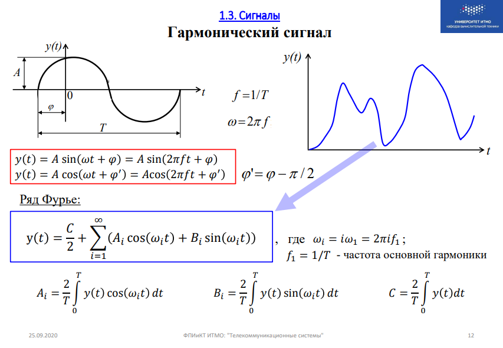
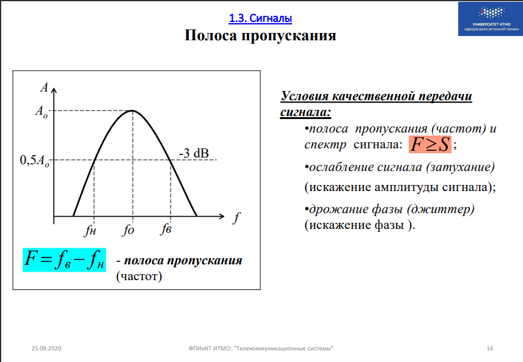

**ОСНОВАНО НА: https://docs.google.com/document/d/1jBoWhhwzFlEuGqkzrdY34mYNTOKUfFyEaWUodqWGp0E/edit**

1. В чем состоит удобство вычисления затухания сигнала в дБ?

    > Удобство вычисления ослабления (усиления) в децибелах состоит в том, что при каскадном включении нескольких участков линии или устройств значения d складываются, а коэффициенты передач – перемножаются.

2. Во сколько раз уменьшится мощность сигнала на расстоянии 100 м, если его ослабление равно: d=10 дБ/км?

    > d = 101 * g * (Pвых / Pвх)
    > Pвых / Pвх = кооэф. передачи = 100 м = 0.1 км
    > 10 = 101

3. Нарисовать график гармонического сигнала и показать на графике его параметры.    Записать функцию, описывающую гармонический сигнал. 
    > 
    > где A - амплитуда, φ - фаза, T - период, t - время

4. Записать и пояснить представление функции, отображающей непрерывные данные, в виде ряда Фурье.

    > Известно, что любая периодическая функция y(t) может быть разложена в ряд Фурье, представляющий собой сумму синусоид и косинусоид, называвемых гармониками, с разными параметрами - амплитудами, частотами и начальными фазами. Гармоника с наименьшей частотой называется первой или основной гармоникой, частоты же всех остальных гармоник кратны основной частоте.

5. Понятие сигнала (функции) с ограниченным спектром.

    > Сигнал с ограниченным спектром - сигнал, у которого непрерывный периодический сигнал представлен в виде ряда Фурье с конечным числом косинусоид, расположенных в ограниченной полосе частот.

6. Какой спектр частот характерен для дискретных сигналов?

    > В случае дискретных сигналов разложение в ряд Фурье содержит бесконечное число косинусоид с частотами от 0 до бесконечности. Частота,равная нулю, характеризует постоянную составляющую сигнала, а частота, равная бесконечности, характеризует мгновенные скачки при изменении уровня сигнала. Такие сигналы называются сигналами с неограниченным спектром.

7. При каких условиях обеспечивается качественная передача сигнала?

    >Полоса пропускания частот канала связи должна быть не меньше чем спектр частот сигнала S

8. Проиллюстрировать на графике понятие полосы пропускания линии связи. Какую полосу пропускания имеет телефонный канал (аналоговая проводная линия связи)?

    >
    > F = Fв - Fн 

9. По каким каналам можно передавать дискретные сигналы в их естественном виде – без модуляции (в первичной полосе частот)?

    > При использовании высокочастотных проводных и кабельных линий, полоса частот которых начинается примерно от нуля

10. Как передаются сигналы в высокоскоростных каналах связи с резко ограниченной полосой частот?

    > Передача сигналов в этой полосе осуществляется путём переноса сигнала с помощью модема

11. Что такое модуляция и для чего она нужна?

    >Перенос сигнала в заданную полосу частот путем изменения параметров(амплитуды, частоты) переносчика сигнала

12. Чем манипуляция отличается от модуляции?

    > Процесс представления дискретных данных в виде непрерывного высокочастотного синусоидального сигнала по своей сути является аналоговой модуляцией дискретных данных. Однако, для того чтобы его отличать от аналоговой модуляции непрерывных данных, такое преобразование часто называют манипуляцией. 

13. Пояснить принцип амплитудной, частотной и фазовой модуляции.

    > Амплитудная - для представления 0 и 1 используются разные уровни амлитуд
    > Частотная модуляция - 0 и 1 представляются синусоидами с различной частотой.
    > Фазовая модуляция - 0 и 1 представляются синусоидами с одинаковой частотой, но разными фазами

14. Что такое ИКМ?

    > Импульсно-кодовая модуляция – метод модуляции, при котором аналоговый сигнал кодируется сериями импульсов, представляющими собой цифровые коды амплитуд в точках отсчета аналогового сигнала.

15. Пояснить различие между АИМ и ИКМ.

    > АИМ - амплитудно-импульсная модуляция - заключается в преобразовании непрерывного сигнала в совокупность дискретных сигналов с определенной амплитудой. 
    > Признаком информации в АИМ является амплитуда, а у ИКМ - цифровые коды 

16. Показать, за счет чего обеспечивается скорость передачи данных в 64 кбит/с (56 кбит/с) при ИКМ.

    > Дискретизация по времени, как и в случае АИМ, выполняется в соответствии с теоремой Котельникова. Поскольку ИКМ первоначально разрабатывалась для передачи телефонных данных (голоса) по телефонным каналам, имеющим резко ограниченную полосу пропускания в интервале от 300 Гц до 3400 Гц, то в соответствии с теоремой Котельникова частота дискретизации должна быть больше, чем 6800 Гц. Стандартом - 8000 Гц. 
    > Амплитуда аналогового сигнала измеряется 8000 раз в секунду, то есть каждые 125 мкс. 
    > Для качественного восстановления аналогового сигнала (голоса) достаточно иметь 256 уровней дискретизации, что позволяет передавать в каждый момент времени значение амплитуды (номер уровня) сигнала с помощью 8-разрядного цифрового кода (8 битов). 
    > Результирующий дискретный поток данных передается со скоростью 8000 [раз в секунду]*8 [бит] = 64 000 бит/с, то есть для передачи оцифрованного голоса требуется канал связи с пропускной способностью 64 кбит/с

17. Пояснить принцип адаптивной разностной (дифференциальной) ИКМ.

    > По каналу связи передаётся не значение амплитуды, а разность между текущим значением непрерывного сигнала в точке квантования и предыдущим

18. В чём различие между линейным и первичным сигналом?

    >Первичный сигнал - сигнал до поступления к передатчику
    >Линейный сигнал - сигнал после модуляции

19. Перечислить характеристики цифрового канала связи.

    > Скорость модуляции \[бод]  - число интервалов модуляции передаваемого сигнала в секунду - измеряется
    > Пропускная способность канала связи \[бит/с] - предельная скорость передачи данных - количество данных за секунду
    > Достоверность передачи данных - вероятность искажения бита вследствие шумов и других негативных факторов

20. От чего зависит пропускная способность канала связи?

    > От мощности сигнала, полосы пропускания, влияния среды (шумов)

21. Рассчитать максимально возможную пропускную способность (Мбит/с) канала связи при условии, что ширина полосы пропускания равна 20 МГц, а отношение мощности сигнала к мощности шума равно 3.

    > C = F * log2(1 + Рс/Рш) = 20 * log2(4) = 40 МБит/с

22. В чём отличие пропускной способности от скорости передачи данных?

    > Скорость передачи данных - фактическая скорость, с которой передаются данные
    > Пропускная способность - максимально возможная теоретически скорость

23. Какие скорости передачи данных обеспечивает телефонный канал?

    > ОТ 32 КБит/с до 50 Мбит/с

24. Какие методы мультиплексирования используются в вычислительных сетях?

    > Технология формирования многоканальных систем передачи данных
    > Виды:
    > частотное - формирование в пределах полосы пропускания нескольких логических каналов, различимых частотным промежутоком
    > временное - поочередное предоставления канала
    > волновое - частотное уплотнение на очень высоких частотах

25. Как называется процесс представления непрерывных данных в виде физических сигналов для их передачи по каналам связи?

    > Модуляция

26. Как называется процесс представления дискретных данных в виде физических сигналов для их передачи по каналам связи?

    > Физическое кодирование

27. От чего зависит спектр результирующего модулированного сигнала?

    > От передаваемых данных. Если есть длинная последовательность нулей или единиц спектр сигнала сдвигается в сторону низких частот.

28. Как спектр результирующего модулированного сигнала зависит от скорости модуляции (скорости передачи данных)? Ответ пояснить.

29. Перечислить требования к методам цифрового кодирования.

    > Минимизация спектра результирующего сигнала
    > Поддержка синхронизации
    > Отсутствие постоянной составляющей
    > Возможность обнаружения ошибки
    > Низкая стоимость реализации

30. Как битовая скорость связана со спектром результирующего сигнала?

    > Через скорость модуляции

31. В чем заключается проблема синхронизации при передаче цифровых сигналов?

    > Нужно определить момент считывания очередного битового интервала на приемнике

32. Что такое самосинхронизирующийся код?

    > В этих методах синхронизация приемника с передатчиком выполняется на основе признака, в качестве которого служит любой резкий перепад сигнала, называемый фронтом сигнала, для определения момента считывания

33. Какие методы кодирования относятся к самосинхронизирующимся?

    > Манчестерский, RZ, AMI

34. От чего зависит стоимость реализации метода кодирования?

    > От полосы пропускания и количества уровней кодирования

35. Что такое постоянная составляющая спектра сигнала и почему она нежелательна?

    > Из-за применением в электрических линиях связи схем для гальванической развязки, препятствующей прохождению постоянного тока.
    >Сдвигает спектр сигнала в область низких частот

36. Какие методы кодирования имеют постоянную составляющую в спектре сигнала?

    > NRZ, AMI, NRZI

37. Почему в телекоммуникационных сетях для синхронизации не используется схема, основанная на отдельной тактирующей линии связи?

    > На больших расстояниях неравномерность скорости распространения сигнала может привести к тому, что тактовый импульс придет настолько позже или раньше соответствующего сигнала данных, что бит данных будет пропущен или считан повторно.

38. Почему проблема синхронизации в телекоммуникационных сетях решается сложнее, чем при обмене данными между компьютером и принтером?

    > Из за большого расстояния и всех вытекающих трудностей: затухание, экономический фактор, количество подключений